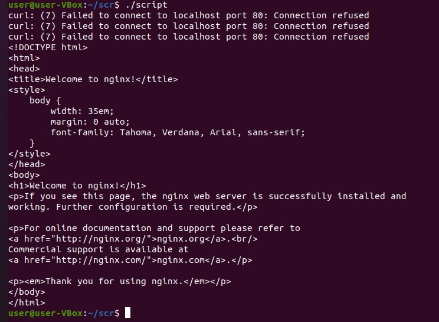

# Домашнее задание к занятию "4.1. Командная оболочка Bash: Практические навыки"

## Обязательные задания

1. Выполнили скрипт:
```
vagrant@vagrant:~$ a=1
vagrant@vagrant:~$ b=2
vagrant@vagrant:~$ c=a+b
vagrant@vagrant:~$ d=$a+$b
vagrant@vagrant:~$ e=$(($a+$b))
vagrant@vagrant:~$ echo $c; echo $d; echo $e
a+b
1+2
3
```
`c=a+b = a+b` - т.к. указаны не переменные `a`, `b`, а просто строка этот результат и отобразился в echo. 
`d=$a+$b = 1+2` - т.к. переменная `d` неявно определена как целочисленное, то результат выполнения будет не арифметическим сложением а строкой.
`e=$(($a+$b)) = 3` - за счёт `(( ))` произвелось арифметическое действие над целыми числами.

1. Для примера использовал запущенный `nginx`, исправил скрипт: 	
	```bash
	#!/usr/bin/env bash
	while ((1==1))
	do
	curl http://localhost
	if (($? != 0))
	then
	date >> curl.log
	else break 
	fi
	sleep 5
	done
	```
`Nginx`, был остановлен и в процессе запущен обратно. Результат выполениия: </br>


1. Необходимо написать скрипт, который проверяет доступность трёх IP: 192.168.0.1, 173.194.222.113, 87.250.250.242 по 80 порту и записывает результат в файл log. Проверять доступность необходимо пять раз для каждого узла.

1. Необходимо дописать скрипт из предыдущего задания так, чтобы он выполнялся до тех пор, пока один из узлов не окажется недоступным. Если любой из узлов недоступен - IP этого узла пишется в файл error, скрипт прерывается

## Дополнительное задание (со звездочкой*) - необязательно к выполнению

Мы хотим, чтобы у нас были красивые сообщения для коммитов в репозиторий. Для этого нужно написать локальный хук для git, который будет проверять, что сообщение в коммите содержит код текущего задания в квадратных скобках и количество символов в сообщении не превышает 30. Пример сообщения: \[04-script-01-bash\] сломал хук.

