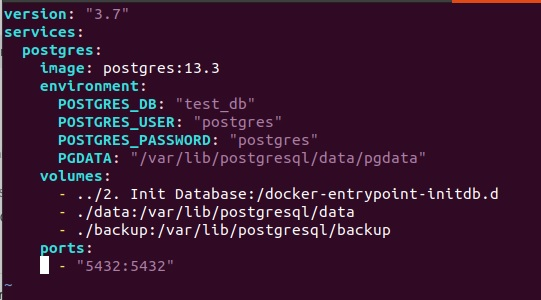
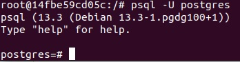
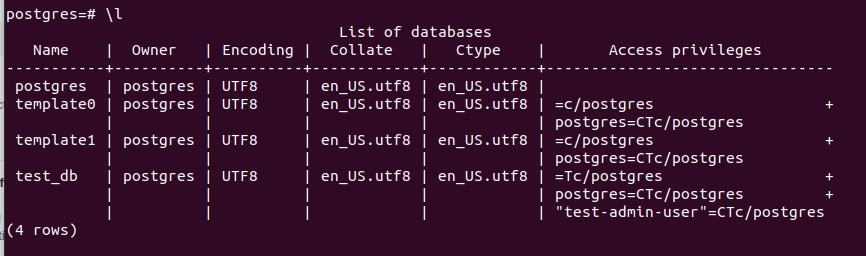
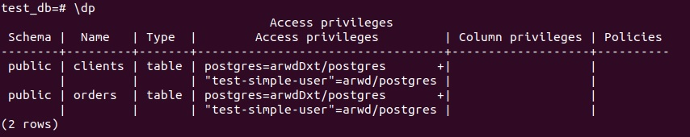
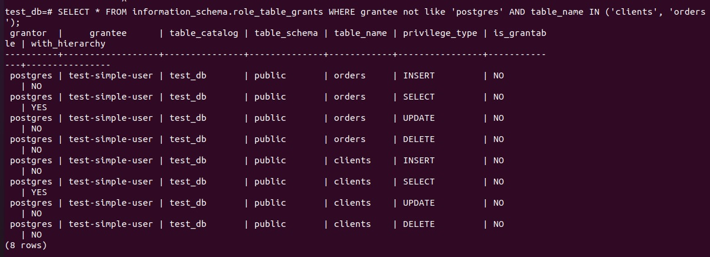

# Домашнее задание к занятию "6.2. SQL"

## Введение

Перед выполнением задания вы можете ознакомиться с 
[дополнительными материалами](https://github.com/netology-code/virt-homeworks/tree/master/additional/README.md).

## Задача 1

Используя docker поднимите инстанс PostgreSQL (версию 12) c 2 volume, 
в который будут складываться данные БД и бэкапы.

Docker-compose.yml:  
  
  


## Задача 2

В БД из задачи 1:  
- создал пользователя test-admin-user и БД test_db:  
```
CREATE DATABASE test_db;
CREATE ROLE "test-admin-user";
```
 
- в БД test_db создал таблицу orders и clients *(спeцификация таблиц ниже)*:  
```
\c test_db
CREATE TABLE orders (id integer PRIMARY KEY, name text, price integer);
CREATE TABLE clients (id integer PRIMARY KEY, surname text, residence_country text, booking integer, FOREIGN KEY (booking) REFERENCES orders (id));
CREATE INDEX countryid ON clients(residence_country); 
```
- предоставил привилегии на все операции пользователю test-admin-user на таблицы БД test_db:
```
GRANT ALL ON DATABASE test_db to "test-admin-user";
```
- создал пользователя test-simple-user:  
```
CREATE USER "test-simple-user";
```
- предоставил пользователю test-simple-user права на SELECT/INSERT/UPDATE/DELETE данных таблиц БД test_db:
```
GRANT SELECT,INSERT,UPDATE,DELETE ON TABLE public.clients TO "test-simple-user";
GRANT SELECT,INSERT,UPDATE,DELETE ON TABLE public.orders TO "test-simple-user";
```
> Таблица orders:
> - id (serial primary key)
> - наименование (string)
> - цена (integer)

> Таблица clients:
> - id (serial primary key)
> - фамилия (string)
> - страна проживания (string, index)
> - заказ (foreign key orders)

Ответы:
- итоговый список БД после выполнения пунктов выше:  
  

- описание таблиц (describe):  
  

- SQL-запрос для выдачи списка пользователей с правами над таблицами test_db  
- список пользователей с правами над таблицами test_db:  
  

## Задача 3

Используя SQL синтаксис - наполните таблицы следующими тестовыми данными:

Таблица orders

|Наименование|цена|
|------------|----|
|Шоколад| 10 |
|Принтер| 3000 |
|Книга| 500 |
|Монитор| 7000|
|Гитара| 4000|

Таблица clients

|ФИО|Страна проживания|
|------------|----|
|Иванов Иван Иванович| USA |
|Петров Петр Петрович| Canada |
|Иоганн Себастьян Бах| Japan |
|Ронни Джеймс Дио| Russia|
|Ritchie Blackmore| Russia|

Используя SQL синтаксис:
- вычислите количество записей для каждой таблицы 
- приведите в ответе:
    - запросы 
    - результаты их выполнения.

## Задача 4

Часть пользователей из таблицы clients решили оформить заказы из таблицы orders.

Используя foreign keys свяжите записи из таблиц, согласно таблице:

|ФИО|Заказ|
|------------|----|
|Иванов Иван Иванович| Книга |
|Петров Петр Петрович| Монитор |
|Иоганн Себастьян Бах| Гитара |

Приведите SQL-запросы для выполнения данных операций.

Приведите SQL-запрос для выдачи всех пользователей, которые совершили заказ, а также вывод данного запроса.
 
Подсказк - используйте директиву `UPDATE`.

## Задача 5

Получите полную информацию по выполнению запроса выдачи всех пользователей из задачи 4 
(используя директиву EXPLAIN).

Приведите получившийся результат и объясните что значат полученные значения.

## Задача 6

Создайте бэкап БД test_db и поместите его в volume, предназначенный для бэкапов (см. Задачу 1).

Остановите контейнер с PostgreSQL (но не удаляйте volumes).

Поднимите новый пустой контейнер с PostgreSQL.

Восстановите БД test_db в новом контейнере.

Приведите список операций, который вы применяли для бэкапа данных и восстановления. 

---
