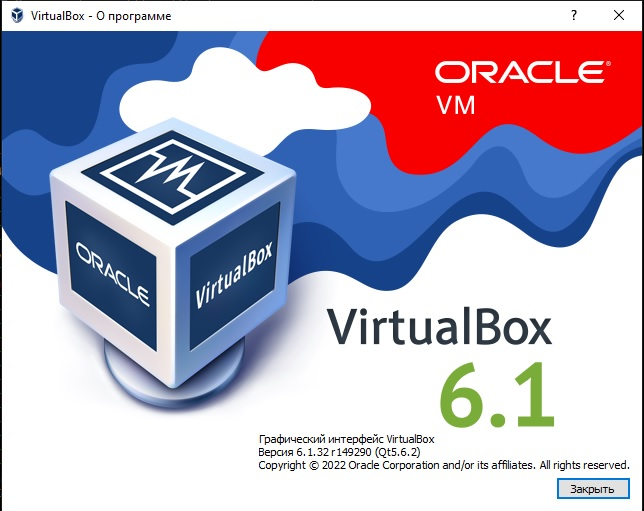
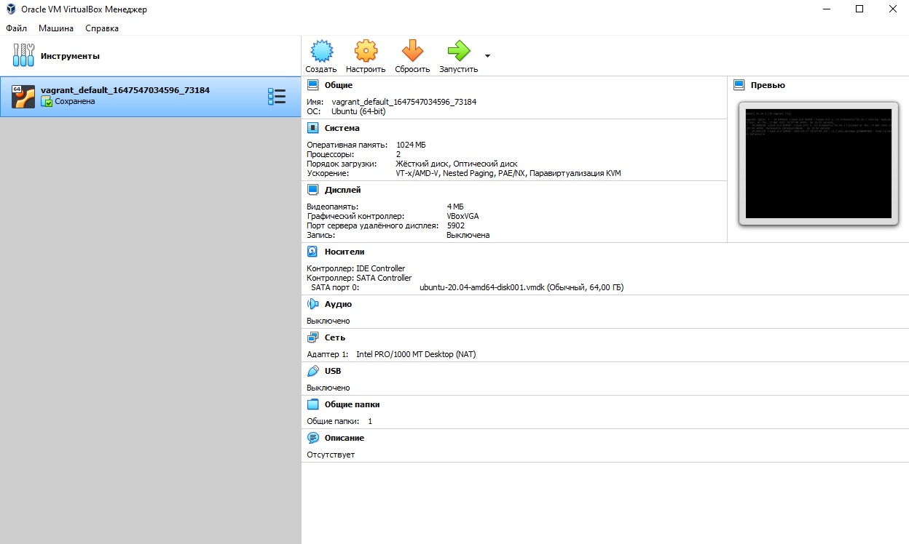
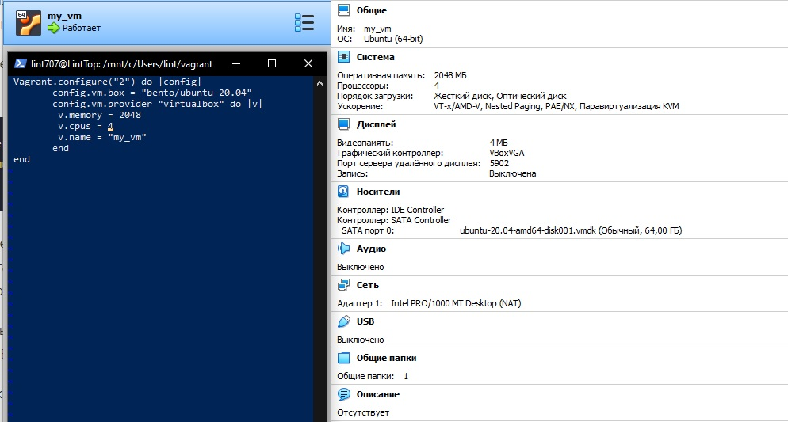
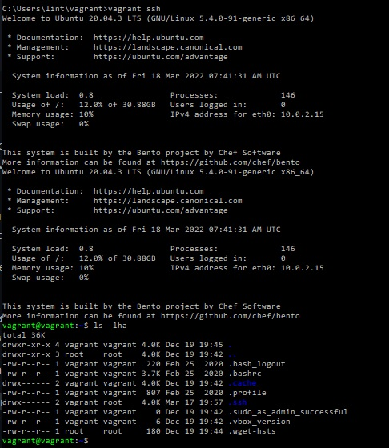

# Домашнее задание к занятию "3.1. Работа в терминале, лекция 1"

1. Установил средство виртуализации [Oracle VirtualBox](https://www.virtualbox.org/). 
      
1. Установил средство автоматизации [Hashicorp Vagrant](https://www.vagrantup.com/).

1. В основном окружении подготовил терминал Windows Terminal в Windows
	
1. С помощью базового файла конфигурации запустите Ubuntu 20.04 в VirtualBox посредством Vagrant:

	* Создал директорию `C:\Users\lint\vagrant`, в которой будут храниться конфигурационные файлы Vagrant. Выполнил `vagrant init`. И заменил содержимое Vagrantfile по умолчанию следующим:

		```bash
		Vagrant.configure("2") do |config|
			config.vm.box = "bento/ubuntu-20.04"
		end
		```

	* Выполненил в этой директории `vagrant up`установился провайдер VirtualBox для Vagrant, был скачан необходимый образ и запущена виртуальная машина.

1. Ознакомился с графическим интерфейсом VirtualBox:


1. Ознакомился с возможностями конфигурации VirtualBox через Vagrantfile: [документация](https://www.vagrantup.com/docs/providers/virtualbox/configuration.html). Добавил оперативную память до **2048** и количество ядер процессора до **4**:


1. Выполнил команду `vagrant ssh` из директории, в которой содержится Vagrantfile:


1. Ознакомиться с разделами `man bash`, почитать о настройках самого bash:
    * какой переменной можно задать длину журнала `history`, и на какой строчке manual это описывается?
    * что делает директива `ignoreboth` в bash?
1. В каких сценариях использования применимы скобки `{}` и на какой строчке `man bash` это описано?
1. С учётом ответа на предыдущий вопрос, как создать однократным вызовом `touch` 100000 файлов? Получится ли аналогичным образом создать 300000? Если нет, то почему?
1. В man bash поищите по `/\[\[`. Что делает конструкция `[[ -d /tmp ]]`
1. Основываясь на знаниях о просмотре текущих (например, PATH) и установке новых переменных; командах, которые мы рассматривали, добейтесь в выводе type -a bash в виртуальной машине наличия первым пунктом в списке:

	```bash
	bash is /tmp/new_path_directory/bash
	bash is /usr/local/bin/bash
	bash is /bin/bash
	```

	(прочие строки могут отличаться содержимым и порядком)
    В качестве ответа приведите команды, которые позволили вам добиться указанного вывода или соответствующие скриншоты.

1. Чем отличается планирование команд с помощью `batch` и `at`?

1. Завершите работу виртуальной машины чтобы не расходовать ресурсы компьютера и/или батарею ноутбука.
	* `vagrant suspend` выключит виртуальную машину с сохранением ее состояния (т.е., при следующем `vagrant up` будут запущены все процессы внутри, которые работали на момент вызова suspend), `vagrant halt` выключит виртуальную машину штатным образом.

 
 ---
