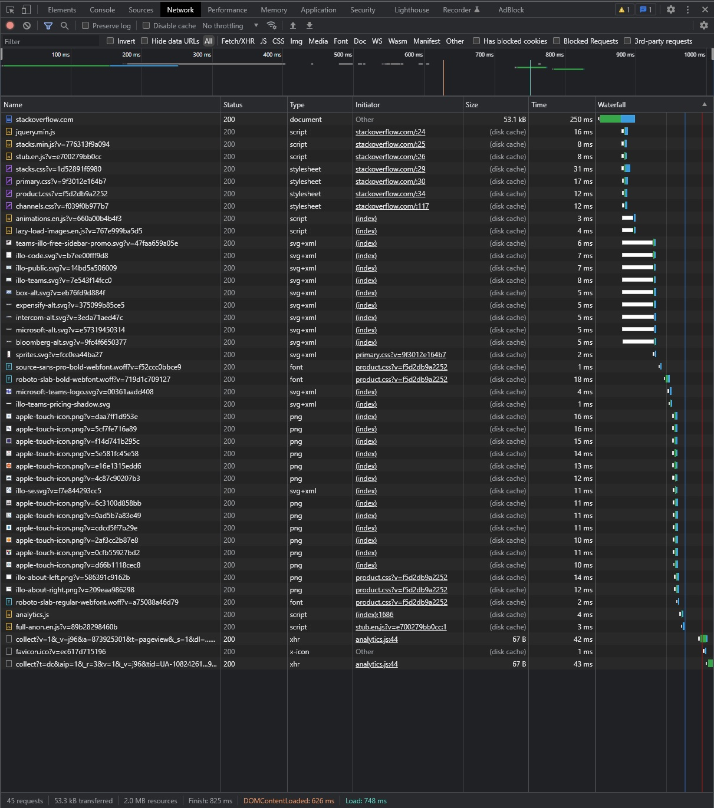
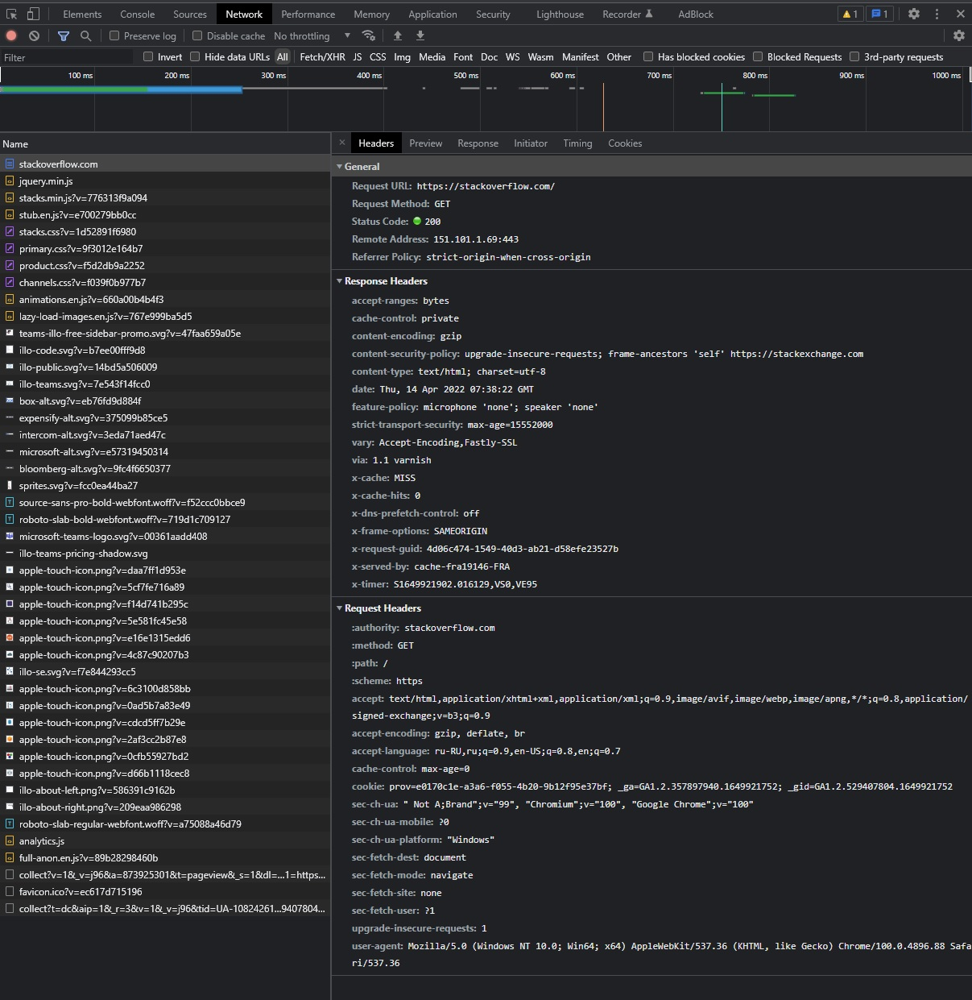
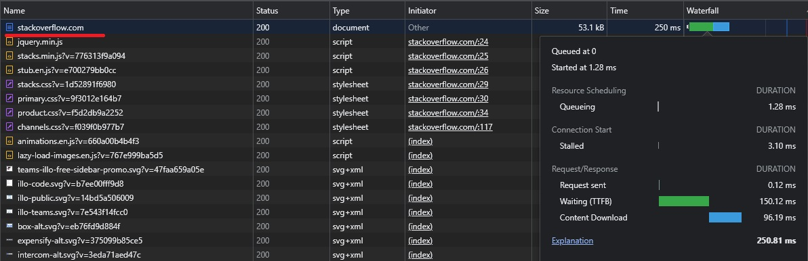
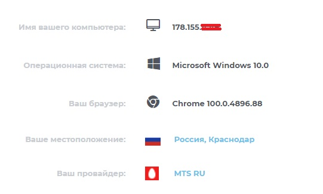

# Домашнее задание к занятию "3.6. Компьютерные сети, лекция 1"

1. Работа c HTTP через телнет.
- Подключился утилитой телнет к сайту stackoverflow.com
`telnet stackoverflow.com 80`
- отправил HTTP запрос
```bash
GET /questions HTTP/1.0
HOST: stackoverflow.com
[press enter]
[press enter]
```
- Полученый результат:
  ```
  vagrant@vagrant:~$ telnet stackoverflow.com 80
  Trying 151.101.1.69...
  Connected to stackoverflow.com.
  Escape character is '^]'.
  GET /questions HTTP/1.0
  HOST: stackoverflow.com
  
  HTTP/1.1 301 Moved Permanently
  cache-control: no-cache, no-store, must-revalidate
  location: https://stackoverflow.com/questions
  x-request-guid: 798d17cb-a2d0-44bf-a65e-b44a2aa2c38a
  feature-policy: microphone 'none'; speaker 'none'
  content-security-policy: upgrade-insecure-requests; frame-ancestors 'self' https://stackexchange.com
  Accept-Ranges: bytes
  Date: Thu, 14 Apr 2022 07:26:22 GMT
  Via: 1.1 varnish
  Connection: close
  X-Served-By: cache-fra19146-FRA
  X-Cache: MISS
  X-Cache-Hits: 0
  X-Timer: S1649921182.225041,VS0,VE93
  Vary: Fastly-SSL
  X-DNS-Prefetch-Control: off
  Set-Cookie: prov=d30ae5ea-6da4-0bf1-8865-2255c837f806; domain=.stackoverflow.com; expires=Fri, 01-Jan-2055 00:00:00 GMT; path=/; HttpOnly
  
  Connection closed by foreign host.
  ```
## Что HTTP код означает? - нужен ответ.
  
2. Повтор задания 1 в браузере, используя консоль разработчика F12.
- открыл вкладку `Network`
- отправил запрос http://stackoverflow.com </br>
  

- первый ответ HTTP сервера, открыл вкладку `Headers`:
  

- проверил время загрузки страницы, приложил скриншот с самым длительным запросом:
  

3. IP адрес: </br>
  

4. Провайдер:
```
vagrant@vagrant:~$ whois 178.155.4.49

inetnum:        178.155.0.0 - 178.155.63.255
netname:        MTS-BROADBAND
descr:          MTS PJSC
country:        RU
admin-c:        MT12425-RIPE
admin-c:        MTS134-RIPE
tech-c:         MT12425-RIPE
tech-c:         MTS134-RIPE
status:         ASSIGNED PA
mnt-by:         KUBANGSM-MNT
created:        2012-03-27T07:58:25Z
last-modified:  2015-12-10T13:25:09Z
source:         RIPE # Filtered
```
AS:
```
route:          178.155.4.0/24
origin:         AS29497
mnt-by:         KUBANGSM-MNT
mnt-by:         MTU-NOC
created:        2017-06-28T00:17:57Z
last-modified:  2017-06-28T00:17:57Z
source:         RIPE
```

5. Данные по `traceroute`: 
##Через какие AS? - нужно НАЙТИ
```
vagrant@vagrant:~$ traceroute -An 8.8.8.8
traceroute: n: Unknown host
traceroute: as_setup failed, AS# lookups disabled
traceroute to 8.8.8.8 (8.8.8.8), 64 hops max, 52 byte packets
 1  xiaoqiang (192.168.31.1)  1.640 ms  1.381 ms  1.238 ms
 2  10.255.61.251 (10.255.61.251)  2.621 ms  3.155 ms  6.985 ms
 3  10.255.61.18 (10.255.61.18)  2.024 ms  2.069 ms  2.416 ms
 4  10.255.61.14 (10.255.61.14)  2.089 ms  2.141 ms  2.030 ms
 5  10.250.245.254 (10.250.245.254)  3.149 ms  3.349 ms
    10.250.245.250 (10.250.245.250)  3.177 ms
 6  10.249.13.30 (10.249.13.30)  7.215 ms
    10.249.13.34 (10.249.13.34)  5.193 ms
    10.249.13.30 (10.249.13.30)  3.921 ms
 7  10.249.12.59 (10.249.12.59)  3.993 ms  76.956 ms  9.195 ms
 8  kai-cr01-ae23.200.rnd.mts-internet.net (195.34.36.114)  3.861 ms
    10.249.13.37 (10.249.13.37)  3.910 ms  3.714 ms
 9  * c0-ats22.aaanet.ru (80.80.111.22)  8.621 ms  3.405 ms
10  kai-cr01-ae23.200.rnd.mts-internet.net (195.34.36.114)  2.844 ms * *
11  * 195.34.53.198 (195.34.53.198)  22.857 ms  22.961 ms
12  * a433-cr02-be3.61.msk.mts-internet.net (212.188.28.133)  22.405 ms
    mag9-cr01-be16.77.msk.mts-internet.net (212.188.29.82)  21.893 ms
13  mag9-cr02-be15.77.msk.mts-internet.net (212.188.28.101)  21.951 ms  22.535 ms
    108.170.250.99 (108.170.250.99)  23.608 ms
14  mag9-cr01-be16.77.msk.mts-internet.net (212.188.29.82)  21.648 ms  22.000 ms  21.760 ms
15  172.253.66.108 (172.253.66.108)  37.193 ms
    172.253.66.110 (172.253.66.110)  38.064 ms
    108.170.250.66 (108.170.250.66)  23.642 ms
16  142.251.238.84 (142.251.238.84)  37.148 ms
    209.85.249.158 (209.85.249.158)  37.432 ms
    142.251.237.156 (142.251.237.156)  38.371 ms
17  * * 172.253.65.159 (172.253.65.159)  37.091 ms
18  142.250.209.161 (142.250.209.161)  40.738 ms
    108.170.233.161 (108.170.233.161)  37.412 ms *
19  * * *
20  * * *
21  * * *
22  * * *
23  * * *
24  * * *
25  * * *
26  * * *
27  * 8.8.8.8 (8.8.8.8)  37.699 ms *
```

6. Повторил задание 5 в утилите `mtr`. 
```
 My traceroute  [v0.93]
vagrant (10.0.2.15)                                                                            2022-04-14T12:32:33+0000
Keys:  Help   Display mode   Restart statistics   Order of fields   quit
                                                                               Packets               Pings
 Host                                                                        Loss%   Snt   Last   Avg  Best  Wrst StDev
 1. AS???    10.0.2.2                                                         0.0%   405    0.2   0.2   0.1   2.8   0.3
 2. AS???    192.168.31.1                                                     0.0%   405    1.1   1.2   0.7  12.0   1.0
 3. AS???    10.255.61.251                                                    0.0%   405    2.5   2.7   1.9  16.2   1.2
 4. AS???    10.255.61.18                                                     0.0%   405    1.7   2.7   1.4  40.1   4.3
 5. AS???    10.255.61.14                                                     0.0%   405    1.8   2.1   1.4  14.4   1.4
 6. AS???    10.250.245.254                                                   0.0%   405    3.0   4.2   2.5  34.0   3.7
 7. AS???    10.249.12.29                                                     0.0%   405    3.3   4.1   2.3  33.0   3.5
 8. AS8359   195.34.36.115                                                    0.0%   405    4.3   3.4   2.1  38.8   3.3
 9. AS8359   195.34.36.114                                                    0.0%   404    2.4   3.0   2.0  29.9   2.4
10. AS8359   195.34.53.198                                                   78.7%   404   22.3  23.4  21.4  33.7   2.1
11. AS8359   212.188.28.133                                                  91.8%   404   22.3  21.8  21.2  24.0   0.5
12. AS8359   212.188.28.101                                                   4.2%   404   22.5  21.9  21.2  30.7   1.2
13. AS8359   212.188.29.82                                                    0.0%   404   22.2  21.7  20.9  31.0   1.1
14. AS15169  108.170.250.99                                                   0.0%   404   22.9  23.3  22.5  32.2   1.1
15. AS15169  142.250.238.138                                                  0.0%   404   35.9  37.8  34.9 156.8  12.0
16. AS15169  142.250.233.0                                                    0.0%   404   36.8  40.2  36.0 110.0  10.5
17. AS15169  108.170.233.161                                                  0.0%   404   44.4  34.2  33.6  50.9   1.4
18. (waiting for reply)
19. (waiting for reply)
20. (waiting for reply)
21. (waiting for reply)
22. (waiting for reply)
23. (waiting for reply)
24. (waiting for reply)
25. (waiting for reply)
26. (waiting for reply)
27. AS15169  8.8.8.8                                                          0.0%   404   34.8  34.6  33.8  45.4   1.2
```
Наибольшая задержка на участке: </br>
`15. AS15169  142.250.238.138                                                  0.0%   404   35.9  37.8  34.9 156.8  12.0`</br>

7. Какие DNS сервера отвечают за доменное имя dns.google? Какие A записи? воспользуйтесь утилитой `dig`


8. Проверьте PTR записи для IP адресов из задания 7. Какое доменное имя привязано к IP? воспользуйтесь утилитой `dig`


---
